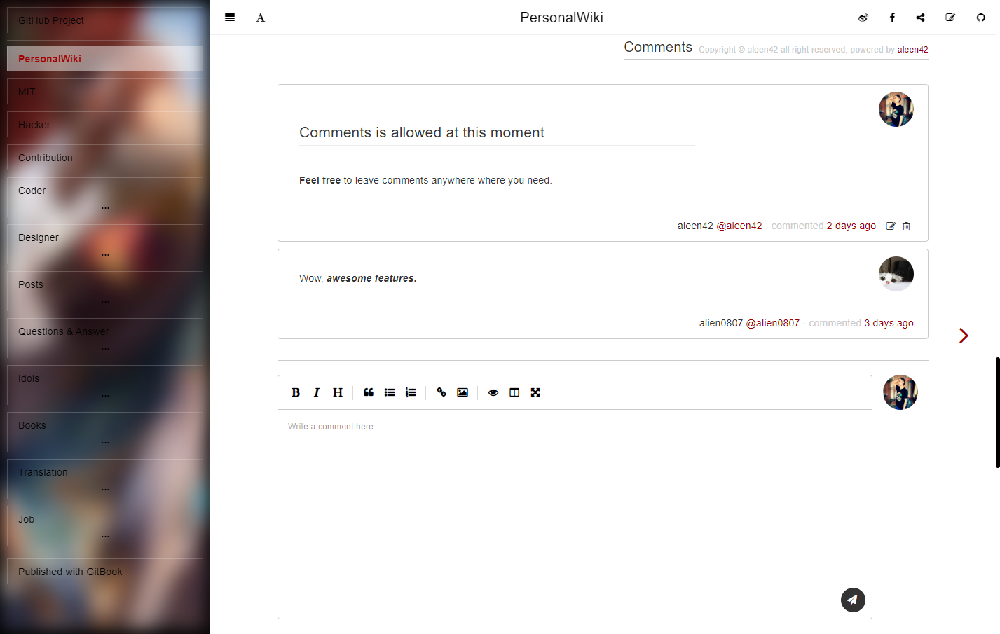
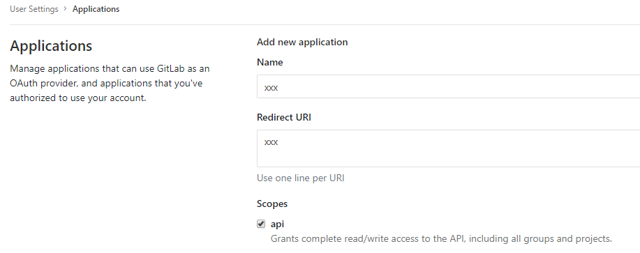

## gitbook-comments

A project focusing on comments integrated with code management providers like GitLab or GitHub.

  [](https://github.com/aleen42/gitbook-comments/issues) [](https://raw.githubusercontent.com/aleen42/gitbook-comments/master/LICENSE)

[](https://www.npmjs.com/package/gitbook-plugin-comments-footer) [](https://david-dm.org/aleen42/gitbook-comments#info=devDependencies) [](https://www.npmjs.com/package/gitbook-plugin-comments-footer)



### Installation

Add the following plugins to your `book.json` and run the command `gitbook install`

```json
{
    "plugins": ["comments-footer"]
}
```

### Usage

#### 1. GitHub

To use this plugin in a GitBook project deployed on GitHub, the first step is to install [the GitHub app](https://github.com/apps/aleen42-gitbook-comments) in your repository for accessing.

And then, the configuration option can be set as an object like the following snippet:

```json
{
	"plugins": [
		"comments-footer"
	],
	"pluginsConfig": {
		"comments-footer": {
			"type": "github",
			"repo": "aleen42/PersonalWiki",
			"copyright": "Copyright © aleen42"
		}
	}
}
```

#### 2. GitLab

What if using it in GitLab? You may need to create an application yourself with `API` scope accessing.



- **Name**: any name you want
- **Redirect URI**: the page url you published
- **Scopes**: choose `api`

And then, the configuration option can be set as an object like the following snippet:

```json
{
	"plugins": [
		"comments-footer"
	],
	"pluginsConfig": {
		"comments-footer": {
			"type": "gitlab",
			"repo": "fe-components/fe-documents",
			"copyright": "Copyright © aleen42",
			"redirect": "xxx",
            "clientId": "xxx",
            "host": "http://git.xxx.cn/"
		}
	}
}
```

- **redirect**: the page url you published
- **clientId**: the Application ID of your application created above
- **host**: the GitLab server host

### TODO

- [ ] Disable subscribing states when commenting on articles.
- [ ] Discussion features on GitLab.
- [x] ~~GitLab features depend on the functions around commit comments: https://gitlab.com/gitlab-org/gitlab-ce/issues/59798.~~ Use discussion instead.
- [x] ~~GitLab private access token has no detailed scope for avoiding abusing by others.~~ It means that I cannot get discussions when users do not authorize themselves.

### Release History

* ==================== **1.0.0 Initial release** ====================
	* 1.1.2 oauth2 integration
	* 1.1.3 initial structure for featuring GitHub
	* 1.1.4 fix bug
	* 1.1.5 enhancement for reducing authorizing redirecting
	* 1.1.6 enhancement of compatible styles
	* 1.1.9 styles for the authorization wrapper and unexpected redirect url
	* 1.2.0 support GitLab
	* 1.2.2 fix commented time and passed parameters when leaving comments in GitLab
	* 1.2.3 show user link anchor
	* 1.2.5 bug fix and show site link after leaving comments

### :fuelpump: How to contribute

Have an idea? Found a bug? See [how to contribute](https://aleen42.github.io/PersonalWiki/contribution.html).

### :scroll: License

[MIT](https://aleen42.github.io/PersonalWiki/MIT.html) © aleen42
